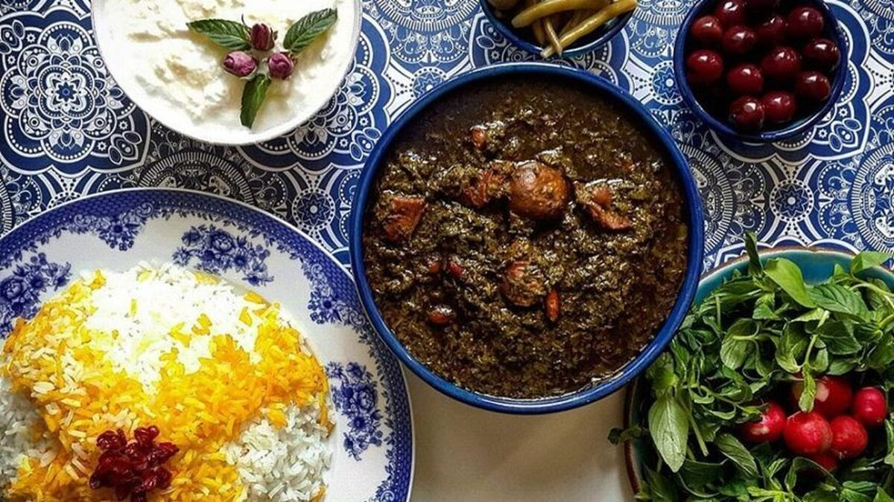

# qorme-sabzi

# Perfektes Qorme Sabzi

Ein Projekt zur Verwaltung und gemeinsamen Nutzung von Qorme-Sabzi-Rezepten! Dieses Projekt hilft Ihnen, das beste Qorme Sabzi zuzubereiten und Ihre Rezepte mit anderen zu teilen.

## Inhaltsverzeichnis

- [Über das Projekt](#über-das-projekt)
  - [Verwendete Technologien](#verwendete-technologien)
- [Erste Schritte](#erste-schritte)
  - [Voraussetzungen](#voraussetzungen)
  - [Installation](#installation)
- [Verwendung](#verwendung)
- [Roadmap](#roadmap)
- [Mitwirken](#mitwirken)
- [Lizenz](#lizenz)
- [Kontakt](#kontakt)
- [Danksagungen](#danksagungen)

---

## Über das Projekt

Qorme Sabzi ist eines der beliebtesten Gerichte im Iran, und dieses Projekt hilft Ihnen, die besten Rezepte zuzubereiten. Benutzer können ihre eigenen Rezepte hinzufügen, bewerten und sogar Kochtipps teilen.



### Verwendete Technologien

- [](https://reactjs.org/) für die Benutzeroberfläche
- [](https://nodejs.org/) für das Backend
- [](https://www.mongodb.com/) für die Datenspeicherung

---

## Erste Schritte

Befolgen Sie die folgenden Schritte, um mit dem Projekt zu beginnen:

### Voraussetzungen

Vor der Installation des Projekts benötigen Sie folgende Werkzeuge:

- Node.js
  ```sh
  npm install npm@latest -g
  ```

### Installation

1. Klonen Sie das Repository:
   ```sh
   git clone https://github.com/your-username/qorme-sabzi.git
   ```
2. Wechseln Sie in das Projektverzeichnis:
   ```sh
   cd qorme-sabzi
   ```
3. Installieren Sie die Abhängigkeiten:
   ```sh
   npm install
   ```

---

## Verwendung

Um das Projekt auszuführen:

1. Starten Sie den Server:
   ```sh
   npm start
   ```
2. Öffnen Sie Ihren Browser und gehen Sie zu:
   ```
   http://localhost:3000
   ```
3. Nutzen Sie Funktionen wie das Hinzufügen von Rezepten, das Anzeigen von Benutzertipps und das Bewerten von Rezepten.

---

## Roadmap

- [x] Hinzufügen der Möglichkeit, Rezepte einzureichen
- [x] Suche nach Rezepten basierend auf Zutaten
- [ ] Hinzufügen der Möglichkeit, Bilder hochzuladen (Demnächst)
- [ ] Veröffentlichung einer mobilen App

---

## Mitwirken

Wenn Sie interessiert sind, beizutragen:

1. Forken Sie das Projekt.
2. Erstellen Sie einen neuen Branch:
   ```sh
   git checkout -b feature/AmazingFeature
   ```
3. Committen Sie Ihre Änderungen:
   ```sh
   git commit -m 'Hinzufügen einer großartigen Funktion'
   ```
4. Pushen Sie die Änderungen:
   ```sh
   git push origin feature/AmazingFeature
   ```
5. Öffnen Sie eine Pull Request.

---

## Lizenz

Dieses Projekt wird unter der MIT-Lizenz veröffentlicht. Weitere Informationen finden Sie in der Datei `LICENSE`.

---

## Kontakt

So erreichen Sie uns:

- Ihr Name - [your.email@example.com](mailto:your.email@example.com)
- Projektlink: [https://github.com/your-username/qorme-sabzi](https://github.com/your-username/qorme-sabzi)

---

## Danksagungen

Besonderer Dank gilt:

- [othneildrew](https://github.com/othneildrew/Best-README-Template) für die README-Vorlage
- [Beliebte iranische Rezepte](https://example.com) für inspirierende Ideen
- Freunde und Familie für die Unterstützung
